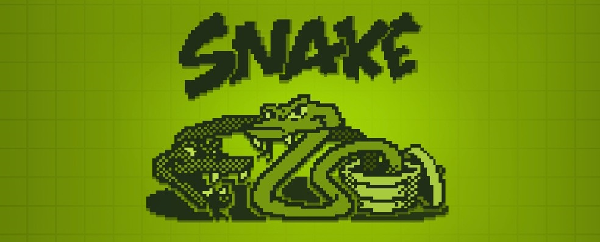

<h2 align="center">🐍 The old snake game, but in JavaScript!

</h2>

<p align="center">
<a hred="https://github.com/Lukega13/Snake">

</a>

<a href="https://github.com/Lukega13/Snake">

</a>

<a href="https://github.com/Lukega13/Snake/blob/master/LICENSE.md">

</a>

<a href="www.linkedin.com/in/luke-guimaraes">

</a>
</p>

<br/>

## 📜 Rules and Features
- [X] The snake is controlled by the arrow keys
- [X] Player can pause the game pressing the "P" key
- [X] The snake moves at a constant speed, only in 4 directions: north, south, east, or west
- [X] The snake starts at the center of the board, moving north
- [X] Snake "moves" by adding a square to its head and simultaneously deleting a square from the tip of its tail
- [X] "Apples" appear at random locations and there is always exactly one apple visible
- [X] When the snake eats an apple, it gets (1 square) longer
- [X] A snake dies by either running into the edge of the board, or by running into its own tail
- [X] If the snake dies the game is ended
- [X] The final score is based on the number of apples eaten by the snake: for each apple eated you win 10 points
- [X] If the snake fills the entire window you win!

<br/>

## 🛠 Technologies
- [JavaScript](https://www.javascript.com/)

<br/>

## 🤔 How it works

To build this software I divided the project in 7 steps:

> ✏️ The code is well commented so I strongly recommend reading it!

<br />

**1. Building the Stage**

The stage was built using the HTMLCanvasElement.getContext('2d') method. This leads to the creation of a CanvasRenderingContext2D object representing a two-dimensional rendering, that will be our stage.

It is composed by 25 * 25 squares, represented by px and py, respectively.

Each piece of the stage has a size (represented by tp), defined by the stage's size (500px) divided by the number of pieces (qp), that I've dicided it's 25.

So, tp = 500 / 25, then tp = 20

This tp variable has great importance for the game operation, because it works like a size determiner of all pieces, and, along with the ax/ay variables and the "for" loop (with the elements of the Trail Array), will determinate coordenates of the stage on wich the apples will apear and also where the snake will appear

> ✏️ It's as is each pixel of the stage has 1 tp. As the canvas has 500px and the game has 25 pieces, so each piece of the board has 20 pixels (or 1 tp)

<br />

**2. Building the Snake and How it Moves**
- A cauda da cobra é um Array, e esse Array começa sem nenhum elemento, quando ela come uma maça é adicionado 1 objeto com as posições vx e vy

->>>> Como a cobra anda? (A função document.addEventListener("keydown", keyPush) possui um Switch para cada tecla que atribuem uma vel(direção) à cobra alterando a posição px e py da cobra pelas variaveis vx, e o loop....)

px e py que recebem a velocidade vx e vy que é definida pelo keypress

.shift() que apaga o ultimo

<br />

**3. Building the Apples**

Apples are randomically generated and placed in a position where the snake's body IS NOT occupying

There is always exactly one apple visible, to generate the next apple, the current one must be eaten 

The first apple is always placed at position 15,15 (ax = ay = 15)

When player "eats" an apple another one is randomically generated again

```
 let ax = ay = 15; // apple's starting X and Y point
 
 ctx.fillStyle = "red";
 ctx.fillRect(ax * tp, ay * tp, tp, tp);
 
 if (ax == px && ay == py) {
 
 tail++;
 
 // And a new apple is created in a random position, which is different from snake's current position
 function randomApple() {
  ax = Math.floor(Math.random() * qp);
  ay = Math.floor(Math.random() * qp);
 }
 randomApple()
 
 // If the position of the new apple is equal to the actual position of the snake, then a new apple wil be generated
 for (let i = 0; i < trail.length; i++) {
 if (trail[i].x == ax && trail[i].y == ay && tail != 1) {
   randomApple()
  }
 }
```

<br />

**4. Start Positions**

Snake starts at the middle of the board (1), with a speed of 90ms per square (2) and heading north (3)

The initial size of the snake is 1 square (4) 

```
1- Starting position of the snake
let px = 12; // snake's starting X point
let py = 12; // snake's starting Y point
    
2- Speed of the snake movimentation in milliseconds per square
let intervalo = null

function interval(flag) {
  if (flag) {
  intervalo = setInterval(game, 90);
  } else {
  clearInterval(intervalo)
  }
}
interval(true)

3- Starting direction of the snake
let vx = 0; // initial X speed
let vy = -vel; // initial Y speed

px += vx;
py += vy;

4- Starting size of the snake
tail = 1
```

<br />

**5. End Game Conditions**

The game can be ended in 3 ways:

- User loses by running into one of the four edges of the board:
```
if (px < 0) {
  gameover() // if snake runs into the left edge the game is over
}
if (px > qp - 1) {
  gameover() // if snake runs into the right edge the game is over
}
if (py < 0) {
  gameover() // if snake runs into the top edge the game is over
}
if (py > qp - 1) {
  gameover() // if snake runs into the bottom edge the game is over
}
```

- User loses by running into its own tail: 
```
if (trail[i].x == px && trail[i].y == py && tail != 1) {
  gameover()
}
```

- User wins if the snake occupies the entire screen
```
if (i == 624) {
  win()
}
```

<br />

**6. Score**

Score starts at 0 and each "eaten apple" (snake passes through) gives 10 points for the player

It's verified by the condition 'if (ax == px && ay == py)', that means: if the positions px,py of the snake (head)
are iqual to the position ax,ay of the apple (apple's position), then player recieves 10 points and another apple is 
created in a randomically position that snake is not occupying 

The score is showed in real time at the game by the variables score and finalScore, and the .innerHtml property of the "score" element

<br />

**7. Aditional Features**

- Instructions

- Pause and Resume

- Restart


<br/>

## ☁️ Installation
Try changing the software variables yourself, and modify the game rules as you wish

```
$ git clone https://github.com/Lukega13/Snake.git
```

<br/>

## Author
| [<br><sub>@Lukega13</sub>](https://github.com/Lukega13) |
| :---: |
