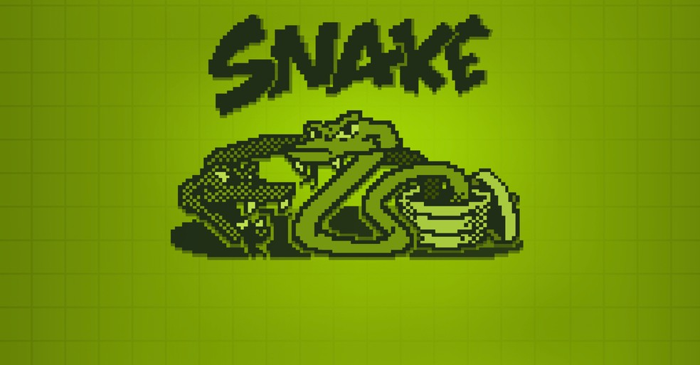

# Snake

The old snake game, but in JavaScript!

OBS: The code is well commented so I strongly recommend reading it!

## How it works
To build this software I divided the project in 6 steps:

- Building the Stage

The stage was built using the HTMLCanvasElement.getContext('2d') method. This leads to the creation of a CanvasRenderingContext2D object representing a two-dimensional rendering, that will be our stage.

It is composed by 25 * 25 squares, represented by px and py, respectively.

Each piece of the stage has a size (represented by tp), defined by the stage's size (500px) divided by the number of pieces (qp), that I've dicided it's 25.

So, tp = 500 / 25, then tp = 20

This tp variable has great importance for the game operation, because it works like a size determiner of all pieces, and, along with the ax/ay variables and the "for" loop (with the elements of the Trail Array), will determinate coordenates of the stage on wich the apples will apear and also where the snake will appear

-> It's as is each pixel of the stage has 1 tp. As the canvas has 500px and the game has 25 pieces, so each piece of the board has 20 pixels (or 1 tp)

-------------> Building the Snake and How it Moves <-----------------------
- A cauda da cobra é um Array, e esse Array começa sem nenhum elemento, quando ela come uma maça é adicionado 1 objeto com as posições vx e vy

->>>> Como a cobra anda? (A função document.addEventListener("keydown", keyPush) possui um Switch para cada tecla que atribuem uma vel(direção) à cobra alterando a posição px e py da cobra pelas variaveis vx, e o loop....)

px e py que recebem a velocidade vx e vy que é definida pelo keypress

.shift() que apaga o ultimo

- Building the Apples

Apples are randomically generated and placed in a position where the snake's body IS NOT occupying

There is always exactly one apple visible, to generate the next apple, the current one must be eaten 

The first apple is always placed at position 15,15 (ax = ay = 15)

When player "eats" an apple another one is randomically generated again

-------------> Start Positions <------------------
- A cobra começa no meio do tabuleiro (posição px e py = 12), com velocidade de 90milissegundos por quadrado (setInterval(game,90))
e direção para norte (vy = -vel), o tamanho inicial da cobra é so 1 quadrado porque o tail = 1

- End Game Conditions

The game can be ended in 3 ways:

1- User loses by running into one of the four edges of the board

2- User loses by running into its own tail

3- User wins if the snake occupies the entire screen

- Score

Score starts at 0 and each "eaten apple" (snake passes through) gives 10 points for the player

It's verified by the condition 'if (ax == px && ay == py)', that means: if the positions px,py of the snake (head)
are iqual to the position ax,ay of the apple (apple's position), then player recieves 10 points and another apple is created in a randomically position that snake is not occupying 

The score is showed in real time at the game by the variables score and finalScore, and the .innerHtml property of the "score" element

## Download
Try changing the software variables yourself, and modify the game rules as you wish

- Downloading...
????Como fazer o download
